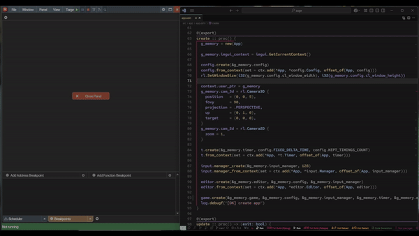

# Breakpoint Sync of Vs Code => The Rad Debugger
Uses the --ipc command line interface of raddbg and sends a "toggle_breakpoint" command whenever a breakpoint is set/removed in VS Code.

- Enable/Disable it with the `Raddbg: Toggle Breakpoint Sync` command.

